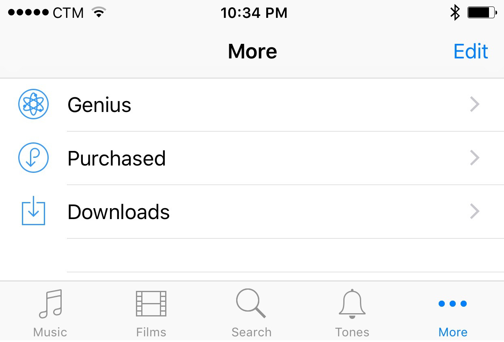
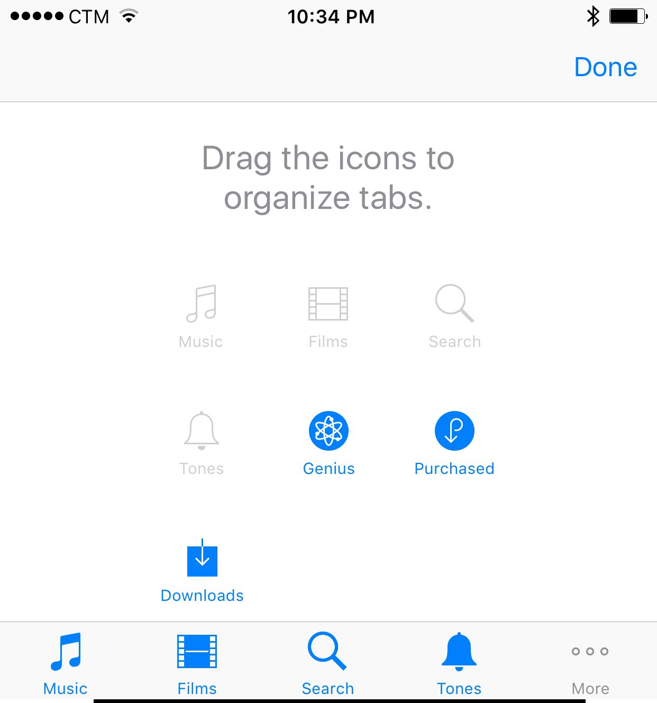

== Mobile Navigation

The strategy to make mobile navigation works.

== Navigation difference between platform

- The difference is huge
- Windows, Android, iOS
- It's not about the style (Skeuomorphism or "flat", or depth)
- It's about the user habits.
- It's about the strategy (tabs on bottom, tabs at top, infinite canvas)
- It's about the hardware buttons that affects the software design

== Hamburger menu?
Conclusion: **Avoid it!**

At least don't just put the hamburger menu there.

== Tabs

.When there are more than 5 tabs.

.iOS allows editing tabs.

== Case study navigation—Facebook

1. First they invented the 9-grid navigation.
+
.9-grid navigation in original Facebook app.

1. Then list view
1. Then hamburger menu
1. Then double hamburger menu
+
.Hamburger menu in Facebook app.

1. Then removed main hamburger menu and back to tab
+
.Tab approach in the latest Facebook app.

