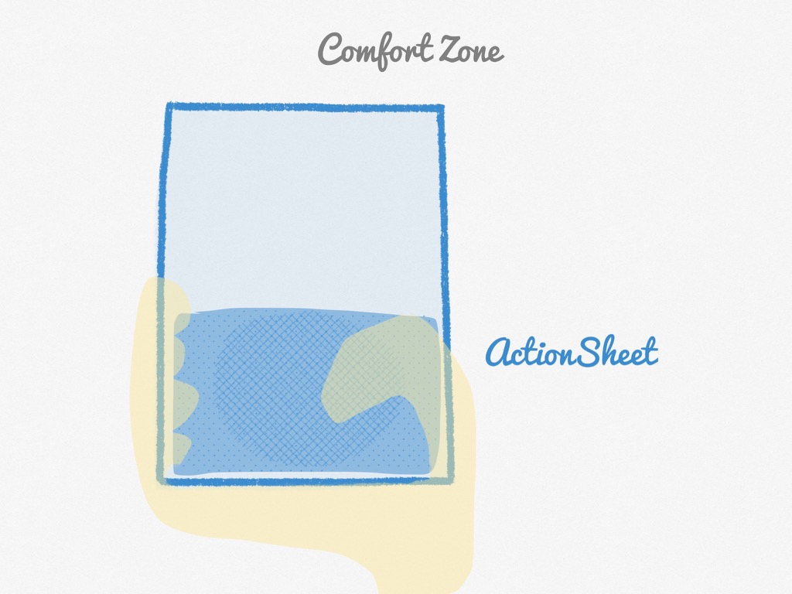
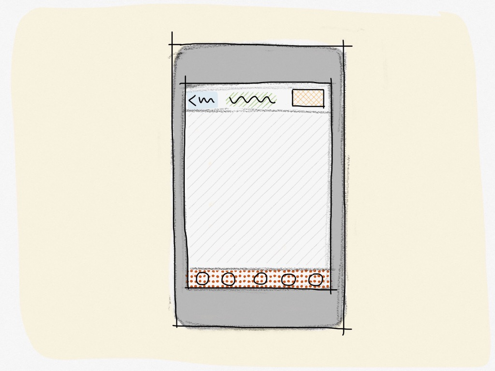

== tapping area

When we design the user interface for mobile apps, we have to consider how the user will really use the app.

Is the app easy to use when user uses it in one hand mode? How about left hand and right hand? How about the difference between a small phone (iPhone 5s) and large phone (iPhone 6 Plus)?

There is a comfort zone for tapping when holding one hand. It's located at the center and near the middle to bottom area.

TODO: Comparability between different phone sizes.

Recommend book: TapWorthy

