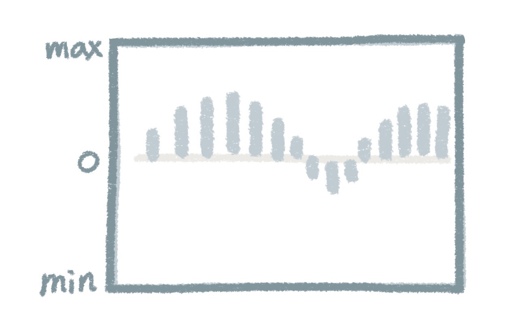
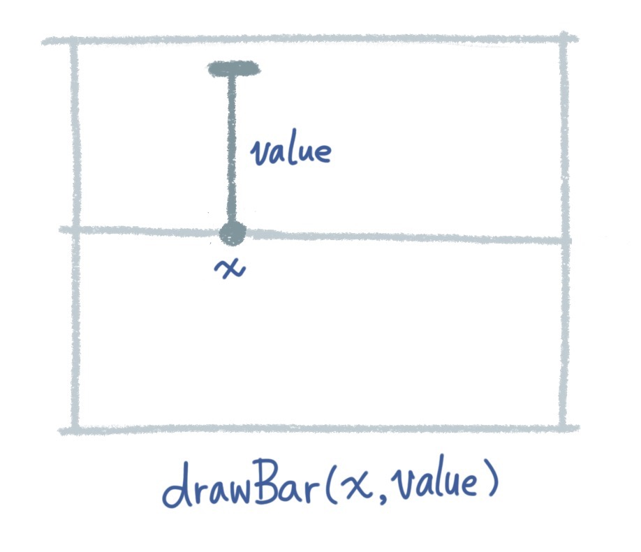

=== Visualize the accelerometer value history a bar chart

.Bar chart visualization

We will use canvas to visualize the value of each axis. You can test the app here: http://mztests.herokuapp.com/motion/

[source,html]
----

  <h2>X</h2>
  <canvas id='x-canvas' width='80' height='40'></canvas>
  <ul id='x' class='history'>
    <li>No Data Yet</li>
  </ul>

----

We will use a graph to show the historical values of the sensor.

.drawBar function

[source,javascript]
----
// Graph
(function(){
  var app = this.app || (this.app={});

  // A bar chart for - Max Value to + Max Value.
  app.Graph = (function(){
    function Graph(canvasId, maxValue){
      this.canvas = document.getElementById(canvasId);
      if (this.canvas) {
        this.context = this.canvas.getContext('2d');
      }

      // set the Y unit scale.
      this.unit = this.canvas.height / 2 / maxValue; // divide by 2 because half for + and half for -.
    }
    Graph.prototype.drawBar = function(x, value) {
      var c = this.context;
      c.beginPath();
      c.moveTo(x, this.canvas.height/2); // middle
      c.lineTo(x, this.canvas.height/2 - value * this.unit);
      c.lineWidth = 3;
      c.strokeStyle = "#222";
      c.stroke();
      c.closePath();
    };
    Graph.prototype.render = function(dataArray) {
      this.canvas.width = this.canvas.width;
      for (var i=0, len=dataArray.length; i<len; i++) {
        this.drawBar(i*5, dataArray[i]);
      }
    }
    return Graph;
  })();
}).call(this);
----

At last, we use the Graph to render the historical data.

[source,javascript]
----
var graphX = new app.Graph('x-canvas', 2.5);
graphX.render(app.xValues);
----

=== Inspecting the gyroscope sensor

You can test the app here: http://mztests.herokuapp.com/rotation/

Comparing to the accelerometer example, the difference is to change the event to `deviceorientation` and use `e.alpha`, `e.beta`, `e.gamma` for the value of rotation axises.

[source,javascript]
----
window.addEventListener('deviceorientation', function (e) {
  app.xValues.push(e.alpha);
  app.yValues.push(e.beta);
  app.zValues.push(e.gamma);
  // ... code that is very similar to the accelerometer section.
}
----
